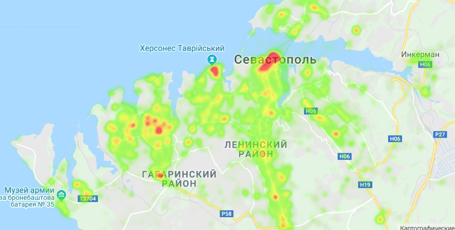

### Processing data collected from VK & Google
#### Using [Python Jupyter](https://jupyter.org/)

This project extract geo-coordinates form user photo metadata from [VK](https://vk.com). 
Save this data as tables in [csv](csv/csv.7z) files.
After that showing the geo-points in map using [heat map](https://en.wikipedia.org/wiki/Heat_map).
This procedure uses [Google Maps API](https://developers.google.com/maps/documentation).

This is only demonstration project but it can be useful 
for collecting information about most favorite places.

I wrote an short [article](https://gainanov.pro/rus-blog/programming/vk-favourite-places-for-photo/)
 about this project. May be it will describe more.

A file [likeplaces.ipynb](likeplaces.ipynb) including full code of this project.

A file [main.py](main.py) including some API calls that I've not test (this code was imported from `Betepok` user).